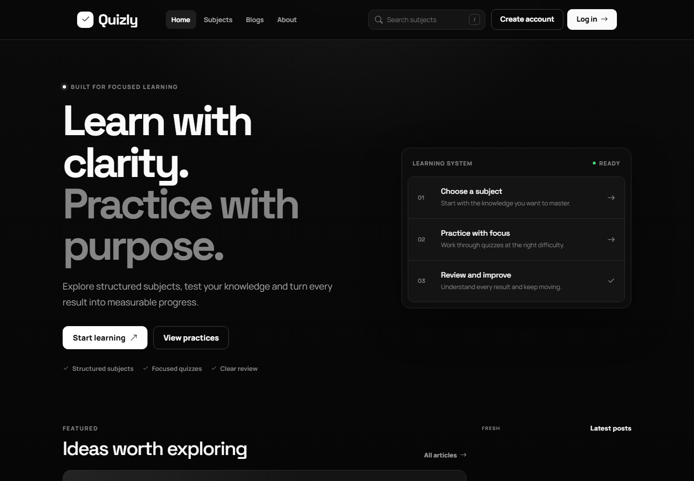
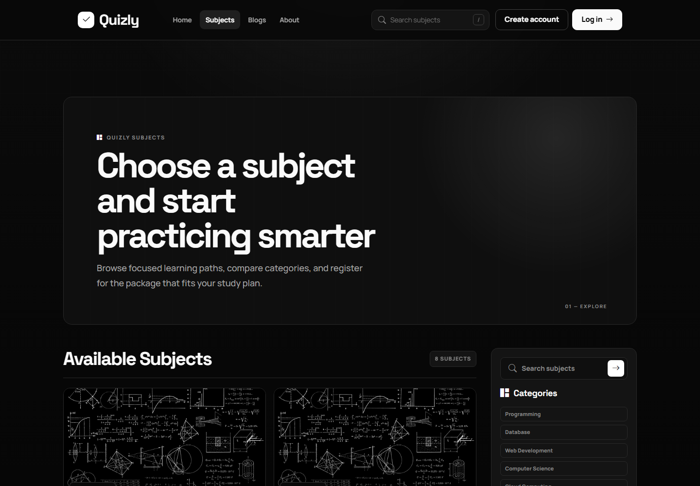
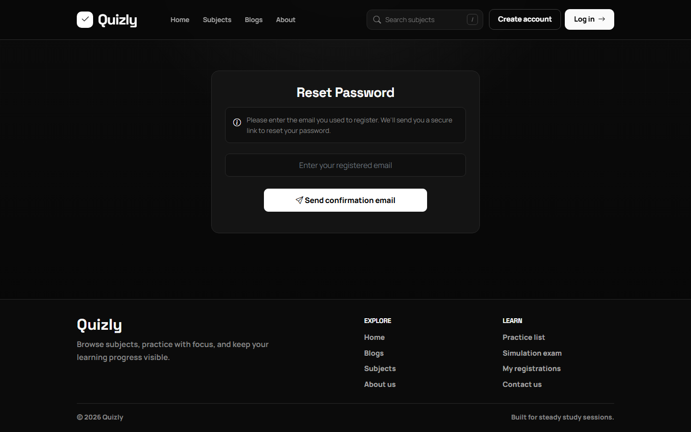

# Quizly

Quizly is a modern quiz-learning platform built with ASP.NET Core MVC. It brings subject discovery, learning-package registration, focused practice, simulation exams, result review, account management, and administrative reporting into one application.

The interface uses a responsive black-and-white design focused on clarity and distraction-free learning.

## Demo

### Home



### Subject discovery



### Password recovery



## Highlights

- Account registration with SMTP email verification
- Login, logout, profile editing, avatar upload, password change, and password reset
- Subject browsing, searching, filtering, and detailed learning-package information
- Subject registration lifecycle with submitted, active, and cancelled states
- Configurable practice sessions by subject, level, question group, and question count
- Simulation exams with attempt tracking and controlled question generation
- Quiz answering, scoring, completion, and answer review
- Blog listing, article details, categories, and latest-post discovery
- Role-based administration and business dashboards
- Responsive, accessible Razor UI with a modern monochrome design

## Core Flows

```text
Register -> verify email -> log in -> update profile

Browse subjects -> choose package -> register -> activate -> practice

Create practice/exam -> answer questions -> submit -> view score -> review answers

Admin login -> dashboard -> manage learning data and review statistics
```

## Tech Stack

| Area | Technology |
| --- | --- |
| Backend | ASP.NET Core MVC, .NET 8 |
| Data | Entity Framework Core 8, Dapper, SQL Server |
| Frontend | Razor Views, Bootstrap, JavaScript, jQuery |
| UI components | Swiper, Chart.js, Bootstrap Icons |
| Email | SMTP with strongly typed configuration |
| Testing | xUnit and ASP.NET Core integration tests |

## Project Structure

```text
Quizzy/
├── ProjectBase/
│   ├── Controllers/       MVC and API controllers
│   ├── Helpers/           DbContext and application helpers
│   ├── Migrations/        EF Core migrations and sample data
│   ├── Models/            Entities, request models, and view models
│   ├── Services/          Email and application services
│   ├── Views/             Razor pages and shared partials
│   ├── wwwroot/           CSS, JavaScript, images, and libraries
│   └── Program.cs         Services and middleware configuration
├── ProjectBase.Tests/     Automated tests
├── docs/screenshots/      README demo images
├── SWP391.sln
└── README.md
```

## Requirements

- .NET SDK 8.0 or later
- SQL Server, SQL Server Express, or LocalDB
- Optional: a Gmail account and App Password for verification/reset emails

## Local Setup

Clone the repository and restore dependencies:

```powershell
dotnet restore .\SWP391.sln
```

Configure the database connection in `ProjectBase/appsettings.json` or through User Secrets:

```powershell
dotnet user-secrets init --project .\ProjectBase\ProjectBase.csproj
dotnet user-secrets set "ConnectionStrings:ConnectedDb" "Server=localhost;Database=SWP391;Trusted_Connection=True;TrustServerCertificate=True;" --project .\ProjectBase\ProjectBase.csproj
```

Apply the migrations:

```powershell
dotnet tool install --global dotnet-ef
dotnet ef database update --project .\ProjectBase\ProjectBase.csproj
```

## SMTP Configuration

Keep SMTP credentials outside source control. For Gmail, enable two-step verification and create an App Password, then configure:

```powershell
dotnet user-secrets set "Email:FromAddress" "your-address@gmail.com" --project .\ProjectBase\ProjectBase.csproj
dotnet user-secrets set "Email:Username" "your-address@gmail.com" --project .\ProjectBase\ProjectBase.csproj
dotnet user-secrets set "Email:Password" "your-app-password" --project .\ProjectBase\ProjectBase.csproj
dotnet user-secrets set "Email:BaseUrl" "http://localhost:5152" --project .\ProjectBase\ProjectBase.csproj
```

The non-secret SMTP defaults are already configured for Gmail on port `587` with TLS enabled.

## Run

From the repository root:

```powershell
dotnet run --project .\ProjectBase\ProjectBase.csproj --launch-profile http
```

Open [http://localhost:5152](http://localhost:5152).

## Build and Test

```powershell
dotnet build .\SWP391.sln
dotnet test .\ProjectBase.Tests\ProjectBase.Tests.csproj
```

## Security Notes

- Never commit SMTP passwords, database passwords, or production secrets.
- Verification and password-reset links expire according to the configured lifetime.
- Set `Email:BaseUrl` to the real HTTPS origin when running outside localhost.
- Replace development connection strings and sample accounts before production use.

## Project Status

Quizly is functional locally and is currently focused on completing and hardening application logic before deployment.
